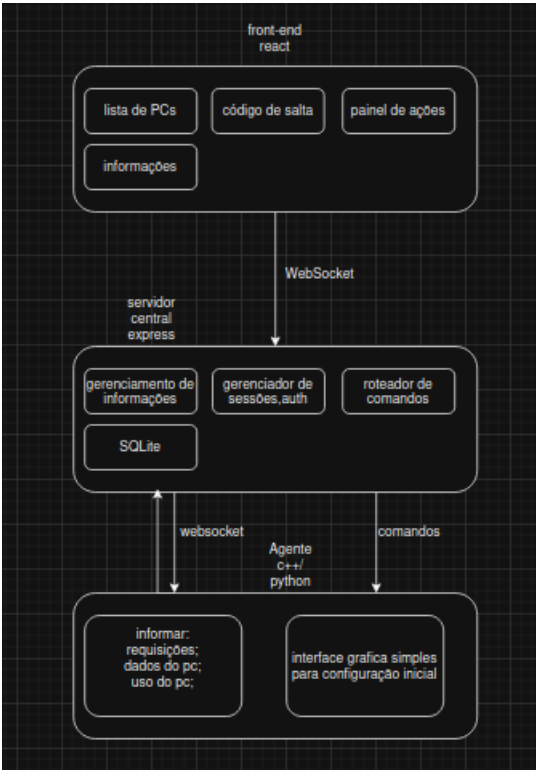

# Ideia: Veyon-inspired

O **Veyon** (Virtual Eye On Networks) é um software livre e de código aberto voltado para o monitoramento e controle de computadores em rede. Ele é muito utilizado por **professores** em laboratórios de informática ou ambientes de ensino digital para gerenciar as estações de **trabalho dos alunos**

resumo da ideia principal: fazer um software de “monitoramento” direcionado para escolas públicas de São Paulo inspirado no Veyon.

De acordo com o artigo “Internet nas escolas públicas: políticas além da política” do Centro Edelstein de Pesquisas Sociais, 48% dos professores concordam que o uso de computadores na escola pelos alunos, para fins pessoais, deveria ser proibido, os professores alegam que essa proibição é burlada na prática em algumas escolas.

### Umas das críticas ao Veyon que podemos melhorar são:

dificuldade em instalação de software: de acordo com o fórum Veyon Community Forum, professores reclamam da grande dificuldade de configuração do Veyon, casos relatam que uma professora tentou configurar 8 desktop e conseguiu só 1 
“Teacher struggling to set up Veyon”
“I am trying to set up 8 desktop computers to run Veyon so I can monitor students computers and have them remain locked until I need them to access them. I have somehow miraculously gotten 1 computer to connect and be able to be monitored and controlled. But others are not working. I get a failed to authenticate response. Is there any easy documentation in setting up a computer because it seems very difficult and daunting!".
 
outras reclamações são sobre:
interface e UX considerados “antigos”,
Dependência forte da rede local e 
configuração inicial difícil

